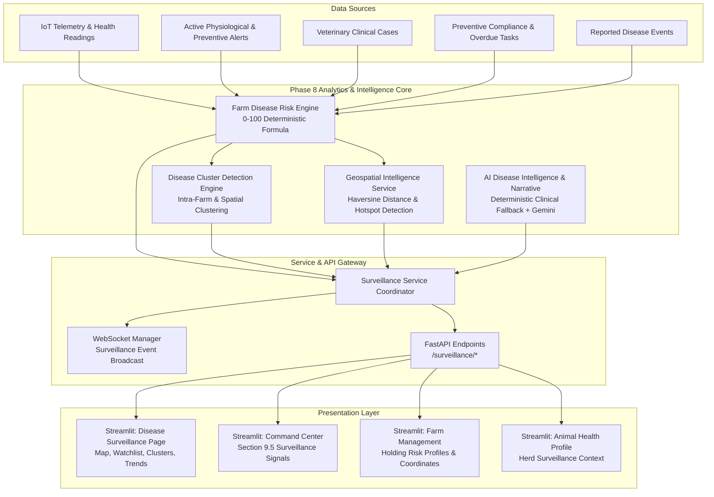
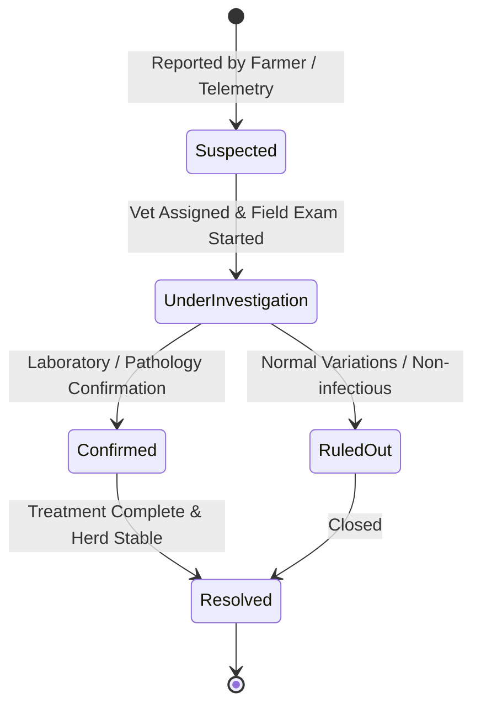

# VETRA Phase 8 — Disease Surveillance & Geospatial Intelligence

## 1. Executive Summary

Phase 8 evolves VETRA from individual animal vitals monitoring to a high-level **Herd & Farm Disease Surveillance and Geospatial Intelligence Platform**. The platform provides statistical syndromic surveillance, deterministic farm risk scoring, disease cluster detection, spatial proximity and hotspot analysis, and regional epidemiological monitoring.

> [!IMPORTANT]
> **Clinical Safety Mandate:**
> VETRA Surveillance is a clinical decision-support and screening platform. It identifies statistical anomalies and syndromic clusters. It **does NOT** independently declare confirmed disease outbreaks. All clusters are flagged as *"Potential Cluster"* or *"Suspected Cluster"*, and official outbreak declaration strictly requires licensed veterinary investigation and diagnostic pathology review.

---

## 2. System Architecture

---

## 3. Disease Event Lifecycle

Disease events track emerging syndromic patterns at the holding level:

### Event Lifecycle States:
- **`suspected`**: Automatically flagged by telemetry deviation or manually entered by farmer/veterinarian.
- **`under_investigation`**: Assigned veterinarian has initiated physical exams, triage, or sample collection.
- **`confirmed`**: Authorized veterinarian or laboratory confirms clinical diagnosis.
- **`ruled_out`**: Clinical investigation determines signs are benign, environmental, or non-infectious.
- **`resolved`**: Therapeutic intervention completed, herd vital metrics returned to baseline.

---

## 4. Deterministic Farm Risk Scoring Formula

The Farm Disease Risk Engine (`backend/app/services/farm_risk_engine.py`) calculates a deterministic score from $0$ to $100$ based on 5 clinical parameters:

$$\text{Farm Risk Score} = S_{\text{telemetry}} + S_{\text{alerts}} + S_{\text{events}} + S_{\text{cases}} + S_{\text{preventive}}$$

| Component | Weight | Calculation Basis |
| :--- | :--- | :--- |
| **Telemetry Abnormality ($S_{\text{telemetry}}$)** | **0 – 25 pts** | Percentage of herd exhibiting abnormal temperature, respiratory, heart rate, or rumination metrics ($0\% = 0$, $<20\% = 8$, $<50\% = 16$, $\ge 50\% = 25$) |
| **Active Alerts ($S_{\text{alerts}}$)** | **0 – 25 pts** | Severity-weighted active unresolved alerts on the holding (Critical = $10$, High = $6$, Medium = $3$, Low = $1$; capped at $25$) |
| **Suspected Events ($S_{\text{events}}$)** | **0 – 20 pts** | Active suspected or under-investigation disease events ($1\text{ event} = 10$, $\ge 2\text{ events} = 20$) |
| **Clinical Cases ($S_{\text{cases}}$)** | **0 – 15 pts** | Open or in-progress veterinary cases on the holding ($1\text{ case} = 8$, $\ge 2\text{ cases} = 15$) |
| **Preventive Care Gaps ($S_{\text{preventive}}$)** | **0 – 15 pts** | Overdue preventive health tasks ($1\text{ overdue} = 7.5$, $\ge 3\text{ overdue} = 15$) |

### Standard Risk Tiers:
- **$0 – 24$ (LOW):** Routine monitoring; vital baseline nominal.
- **$25 – 49$ (MODERATE):** Elevated surveillance; sub-clinical variance or mild alert signals.
- **$50 – 74$ (HIGH):** Field veterinary investigation prioritized; quarantine symptomatic animals.
- **$75 – 100$ (CRITICAL):** Emergency veterinary intervention; acute syndromic cluster suspected.

---

## 5. Disease Cluster & Geospatial Intelligence

### Cluster Detection Logic:
1. **Intra-Farm Clusters:** Detected when $\ge 2$ animals in the same holding demonstrate concurrent physiological anomalies (fever, respiratory distress, metabolic drops) within the rolling surveillance window (default 7 days).
2. **Cross-Farm Proximity Clusters:** Detected when $\ge 2$ holdings within a $25\text{ km}$ radius (or matching district) display elevated risk scores and matching syndromic patterns.

### Geospatial Calculations:
Calculates great-circle distance between coordinate pairs $(lat_1, lon_1)$ and $(lat_2, lon_2)$ using the **Haversine formula**:

$$d = 2 R \arcsin\left(\sqrt{\sin^2\left(\frac{\Delta \phi}{2}\right) + \cos(\phi_1)\cos(\phi_2)\sin^2\left(\frac{\Delta \lambda}{2}\right)}\right)$$

where $R = 6371.0\text{ km}$.

### Hotspot Detection:
- Groups high-risk farms ($\text{Score} \ge 45$ or HIGH/CRITICAL tier) within a $30\text{ km}$ spatial radius into centroid clusters.
- **Missing Coordinate Handling:** If a farm has no registered coordinates, it is gracefully flagged as *"Location unavailable"* in the UI and excluded from distance matrices. **Coordinates are never fabricated.**

---

## 6. Surveillance REST API Endpoints

All endpoints require JWT authentication.

| Method | Endpoint | RBAC Permission | Description |
| :--- | :--- | :--- | :--- |
| `GET` | `/surveillance/overview` | Authenticated | Top-level KPI metrics, active advisory, and safety notice |
| `GET` | `/surveillance/farms` | Authenticated (scoped) | List evaluated farm risk profiles and factor breakdowns |
| `GET` | `/surveillance/farm/{farm_id}` | Authenticated | Detailed risk evaluation for a single holding |
| `GET` | `/surveillance/watchlist` | Authenticated | High-risk holding surveillance watchlist |
| `GET` | `/surveillance/risk-map` | Authenticated | Geospatial coordinates and risk color tiers |
| `GET` | `/surveillance/diseases` | Authenticated | Distribution of dominant disease and syndromic patterns |
| `GET` | `/surveillance/observations` | Authenticated | Dynamic disease observations extracted from telemetry |
| `GET` | `/surveillance/events` | Authenticated | List reported disease events |
| `POST` | `/surveillance/events` | Authenticated | Report new suspected disease event |
| `GET` | `/surveillance/events/{event_id}` | Authenticated | Retrieve specific disease event |
| `PUT` | `/surveillance/events/{event_id}` | Veterinarian / Admin | Update event lifecycle status, notes, or linked vet case |
| `GET` | `/surveillance/clusters` | Authenticated | List potential statistical disease clusters |
| `GET` | `/surveillance/clusters/{id}` | Authenticated | Get detailed cluster metrics and recommendations |
| `GET` | `/surveillance/hotspots` | Authenticated | Get spatial disease hotspots |
| `GET` | `/surveillance/regions` | Authenticated | Regional aggregations by district/state |
| `GET` | `/surveillance/trends` | Authenticated | Bounded day-by-day temporal trends (1–90 days) |
| `POST` | `/surveillance/analyze` | Authenticated | Run AI surveillance narrative synthesis |

---

## 7. Database Collections & Index Optimization

The surveillance engine operates on four MongoDB collections with safe indexes:

1. **`disease_events`**:
   - `event_number` (unique, sparse)
   - `farm_id`
   - `animal_id`
   - `disease_name`
   - `status`
   - `severity`
   - `created_at` (-1)
   - `onset_date`
2. **`disease_observations`**:
   - `farm_id`, `animal_id`, `timestamp` (-1), `indicator`
3. **`disease_clusters`**:
   - `status`, `risk_score`, `first_detected` (-1)
4. **`farm_risk_profiles`**:
   - `farm_id` (unique), `risk_score`, `updated_at` (-1)

---

## 8. Role-Based Access Control (RBAC)

- **Farmers:**
  - View surveillance metrics scoped to their registered agricultural holdings.
  - Report emerging suspected disease events or syndromic signs.
  - Access holding-specific clinical guidance and preventive actions.
- **Veterinarians:**
  - System-wide surveillance and cross-farm cluster inspection.
  - Investigate, confirm, rule out, or resolve disease events.
  - Link disease events directly to veterinary clinical cases.
- **Administrators:**
  - Full jurisdictional surveillance access, regional risk monitoring, and institutional reporting.

---

## 9. Verification & Test Coverage

Phase 8 was validated with a dedicated 18-part test suite (`tests/test_phase_8.py`) alongside existing regression suites:

1. Surveillance route registration (15 OpenAPI endpoints verified)
2. Authentication and security enforcement (401/403 for anonymous requests)
3. Deterministic farm risk scoring (0–100 scale, categories, factor breakdown)
4. Disease event creation (DE-2026-XXXX format, suspected status)
5. Disease event retrieval by ID and event number
6. Disease event update RBAC (farmer denied 403, veterinarian allowed 200)
7. Statistical cluster detection with mandatory clinical safety disclaimer
8. Haversine great-circle distance calculation
9. Hotspot detection from candidate high-risk holdings
10. Missing coordinates handling (no fabrication of false coordinates)
11. Regional surveillance aggregation by district/state
12. Bounded time windows (day-by-day trends clamped to max 90 days)
13. Duplicate alert protection via `surveillance_event_key`
14. Veterinary clinical case escalation and linking
15. Existing alert compatibility (4 alerts preserved intact)
16. AI deterministic clinical fallback (structured narrative generated offline)
17. Surveillance frontend page import and initialization
18. Command Center compatibility (Section 9.5 integration)

### Test Results Summary:
- **`test_phase_8.py`**: **18/18 PASS (100%)**
- **`test_phase_7_3.py`**: **15/15 PASS (100%)**
- **`test_phase_6_7.py`**: **13/13 PASS (100%)**
- **`test_phase_6_6.py`**: **5/5 PASS (100%)**
- **`test_alert_compatibility.py`**: **7/7 PASS (100%)**
- **Streamlit 9-Page Rendering Suite**: **9/9 PASS (0 exceptions)**
- **Database Baseline Count**: **100% UNMUTATED**
