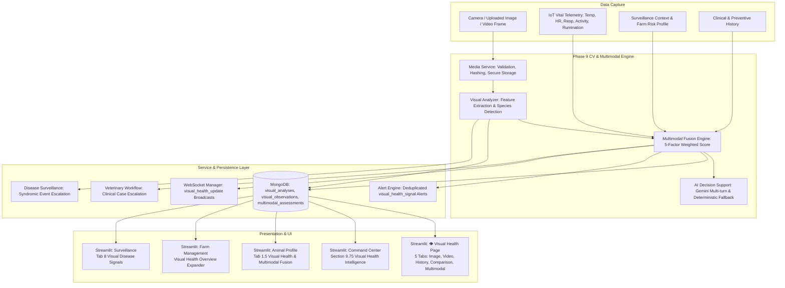

# VETRA Phase 9 — Computer Vision & Multimodal Animal Health Intelligence

## 1. Executive Summary

Phase 9 extends the VETRA Platform from physiological IoT vitals telemetry, clinical records, and geospatial disease surveillance into **Visual Animal Health Intelligence**. The subsystem enables farmers and veterinarians to analyze photographic observations and video clips of livestock to extract visible health markers (posture abnormalities, visible wounds, eye discharge, gait irregularities, coat condition, visible respiratory effort, and distress signals), calculate an explainable **Visual Risk Score (0–100)**, and fuse visual findings with physiological telemetry, disease intelligence, and herd surveillance into a unified **Multimodal Health Assessment**.

> [!IMPORTANT]
> **Clinical Safety Mandate & Decision Support Notice:**
> The Computer Vision and Multimodal subsystems are strictly designed for **clinical decision support**.
> The platform differentiates:
> - **Observed Visual Sign** (e.g., *"Possible visible eye abnormality detected"*)
> - **Possible Health Association** (e.g., *"Associated with ocular irritation or foreign body"*)
> - **AI Risk Assessment** (e.g., *"MODERATE RISK — 42/100"*)
> - **Confirmed Clinical Diagnosis** (e.g., *"Infectious Bovine Keratoconjunctivitis"*)
>
> Computer vision models and AI services **never automatically declare a confirmed disease**. Confirmation is strictly reserved for authorized veterinarians through physical examination.

---

## 2. Logical Architecture

---

## 3. Computer Vision Subsystem & Supported Media

### 3.1 Supported File Types and Limits
- **Still Photographic Media:** `.jpg`, `.jpeg`, `.png`, `.webp` (Maximum allowed: **10 MB**)
- **Motion Video Media:** `.mp4`, `.avi`, `.mov` (Maximum allowed: **25 MB**)

### 3.2 Media Security & Path Traversal Prevention
1. **Filename Sanitization:** Uploaded filenames are never directly used as filesystem paths.
2. **Cryptographic Storage Names:** Files are stored using `<sha256[:16]>_<timestamp>.<ext>`.
3. **Controlled Directories:** Media is written strictly to `D:\VETRA\media\images` or `D:\VETRA\media\videos`.
4. **Traversal Verification:** Absolute path boundary checks verify `abs_target.startswith(abs_base)` before any disk operation.
5. **Decodability Verification:** Images are verified via Pillow before storage to reject malformed or corrupted payloads.

### 3.3 Media Hashing & Deduplication
Every uploaded media file generates a SHA-256 cryptographic digest stored as `media_hash` in `visual_analyses`. This enables:
- Auditability of original evidence
- Duplicate media detection
- Caching of expensive visual inference

---

## 4. Visual Health Observation Model

Visual indicators are categorized objectively as observable physical signs rather than diagnoses:

| Visual Indicator | Description | Severity Range |
| :--- | :--- | :--- |
| `abnormal_posture` | Arched back, head carriage drooping, or irregular stance | Medium – Critical |
| `standing_lying_state` | Prolonged recumbency, difficulty rising, or sternal resting | Medium – High |
| `visible_lethargy` | Drooping ears, reduced responsiveness, dull demeanor | Medium – High |
| `body_condition_irregularity`| Visible skeletal prominence or extreme hollow flank | Low – High |
| `visible_wounds_lesions` | Surface abrasion, laceration, or skin lesion | Medium – Critical |
| `localized_swelling` | Joint, udder, or facial swelling | Medium – Critical |
| `skin_coat_abnormality` | Patchy alopecia, ectoparasite irritation, ringworm-like lesion | Low – High |
| `ocular_nasal_discharge` | Visible lacrimation, crusting, or mucopurulent discharge | Medium – High |
| `gait_irregularity_suspected`| Uneven weight bearing, limp, or reluctance to walk | Medium – High |
| `respiratory_effort_visible` | Flank heaving, extended neck, open-mouth breathing | High – Critical |

### Confidence Classification
Confidence values are categorized into qualitative bands to prevent false precision:
- **High (≥ 80%):** Strong visual marker clarity
- **Moderate (60% – 79%):** Discernible visual variance under standard field lighting
- **Low (< 60%):** Subtle or ambiguous visible pattern; corroboration required

---

## 5. Mathematical Formulations

### 5.1 Visual Risk Score Formula
$$\text{VisualRisk} = \min\left(100, \, \sum_{i=1}^{n} (\text{Confidence}_i \times \text{SeverityWeight}_i) + \text{BaseAdjustment}\right)$$

Where:
- $\text{SeverityWeight}$: $\text{low} = 15$, $\text{medium} = 25$, $\text{high} = 40$, $\text{critical} = 60$
- Score is bounded in $[0, 100]$.

### 5.2 Multimodal Health Risk Formula
Multimodal Health Assessment uses a transparent 5-factor weighted contribution model:

$$\text{CombinedRisk} = (0.30 \times \text{Visual}) + (0.30 \times \text{Telemetry}) + (0.15 \times \text{Disease}) + (0.15 \times \text{Surveillance}) + (0.10 \times \text{Preventive})$$

| Component | Weight | Source | Rationale |
| :--- | :---: | :--- | :--- |
| **Visual Risk** | **30%** | Computer vision analysis | External physical observations & body condition |
| **IoT Telemetry Risk** | **30%** | Wearable collar/bolus sensor | Physiological vitals (Temp, HR, Resp, Activity, Rumination) |
| **Disease Intelligence** | **15%** | Anomaly & syndrome screening | Multi-vital statistical deviation patterns |
| **Herd Surveillance** | **15%** | Farm risk profile & clusters | Epidemiological holding risk and neighboring cluster risk |
| **Preventive Status** | **10%** | Vaccination / deworming logs | Susceptibility due to overdue preventive care |

### 5.3 Risk Tiers
- **CRITICAL (≥ 70.0):** Immediate veterinary physical examination required.
- **HIGH (45.0 – 69.9):** On-site clinical triage advised; active monitoring.
- **MODERATE (25.0 – 44.9):** Sub-clinical observation; reassess in 24 hours.
- **LOW (< 25.0):** Baseline nominal health.

### 5.4 Directional Visual-Telemetry Consistency
The Multimodal Engine evaluates whether physical signs and internal vitals reinforce each other:
- `directionally_consistent`: Both visual signals and telemetry vitals deviate in harmony (e.g., visual heaving + elevated respiratory telemetry). Substantially increases confidence.
- `divergent`: One channel indicates distress while the other is nominal; warrants sensor recalibration or focused clinical inspection.
- `isolated_visual`: Surface or limb issue without systemic vital involvement.
- `isolated_telemetry`: Sub-clinical systemic or metabolic anomaly before external signs manifest.
- `nominal`: Both streams confirm healthy equilibrium.

---

## 6. Video Frame Sampling & Temporal Motion Analysis

Video processing operates under bounded constraints to ensure rapid, deterministic performance:
- Maximum video duration: **30 seconds**
- Sampling strategy: Controlled sampling of up to **10 key frames** across duration.
- Temporal consistency classification:
  - `consistent`: Detected in $\ge 60\%$ of sampled frames (persistent posture/gait sign).
  - `intermittent`: Detected in $25\% - 59\%$ of frames.
  - `isolated`: Detected in $< 25\%$ of frames (momentary movement artifact).

---

## 7. Model Abstraction & Versioning

### 7.1 Architecture
The subsystem uses an abstract base class `VisualModelAdapter` allowing models to be swapped without altering business routes:
- `DeterministicVisualAnalyzer`: High-reliability, deterministic morphological and color-space analysis with graceful fallbacks.
- `GeminiVisualAnalyzer`: Multimodal LLM integration using Gemini vision capabilities.
- `FutureYOLOVisualAnalyzer`: Dedicated livestock object and posture detection model integration point.

### 7.2 Auditability & Versioning
Every analysis records:
- `model_name`: e.g. `VETRA-VisualEngine`
- `model_version`: e.g. `v1.0`
- `processing_time_ms`: Execution latency in milliseconds
- `created_at`: ISO 8601 UTC timestamp
- `clinical_safety_notice`: Mandatory disclaimer on all records

---

## 8. Cross-Subsystem Integrations

### 8.1 Veterinary Clinical Cases (Phase 6.6)
High or critical visual analyses can be escalated directly to official clinical cases via `POST /visual-health/{analysis_id}/veterinary-case`. This creates a case in `veterinary_cases` linked to `visual_analysis_id` with triage priority and suspected conditions populated.

### 8.2 Disease Surveillance & Clusters (Phase 8)
When multiple livestock on the same holding exhibit similar visual anomalies (e.g. widespread skin lesions or ocular discharge), veterinarians can escalate findings to the herd surveillance engine via `POST /visual-health/{analysis_id}/surveillance-review`.

### 8.3 Alert System (Phase 4 / Phase 7)
Analyses resulting in `HIGH` or `CRITICAL` risk automatically trigger a deduplicated alert of type `visual_health_signal` or `multimodal_health_signal` stored in `alerts` and queryable via existing alert workflows.

### 8.4 Real-Time WebSockets (Phase 4 / Phase 7.3)
Events emit `visual_health_update` and `multimodal_health_update` payloads over the existing WebSocket manager (`/ws/monitoring`).

---

## 9. Role-Based Access Control (RBAC)

| Capability | Farmer | Veterinarian | Administrator |
| :--- | :---: | :---: | :---: |
| Upload & Analyze Own Animals | ✅ | ✅ | ✅ |
| Upload & Analyze Foreign Animals | ❌ (403) | ✅ | ✅ |
| View Visual History (Own Holding) | ✅ | ✅ | ✅ |
| Escalate to Veterinary Clinical Case | ✅ | ✅ | ✅ |
| Confirm Surveillance Disease Event | ❌ (403) | ✅ | ✅ |
| Confirm Clinical Diagnosis | ❌ (Human Vet Only) | ✅ | ✅ |

---

## 10. Database Preservation & Verification

The Phase 9 implementation adds 3 dedicated collections while leaving all 14 pre-existing operational collections completely intact:

- `visual_analyses`: Storage metadata, media hashes, scores, observations, review status.
- `visual_observations`: Granular indicator observations for longitudinal and surveillance queries.
- `multimodal_assessments`: Unified 5-factor risk evaluations and directional consistency assessments.

### Baseline Preserved:
- `animals`: 11 records intact
- `devices`: 11 records intact
- `health_readings`: 847 records intact
- `farms`: 2 records intact
- `alerts`: 4 records intact
- `veterinary_cases`: 2 records intact
- `users`: 3 records intact
- `vaccinations`: 1 record intact
- `deworming`: 1 record intact
- `vet_visits`: 1 record intact
- `treatments`: 1 record intact
- `health_records`: 2 records intact
- `preventive_tasks`: 1 record intact
- `audit_logs`: 102 records intact
