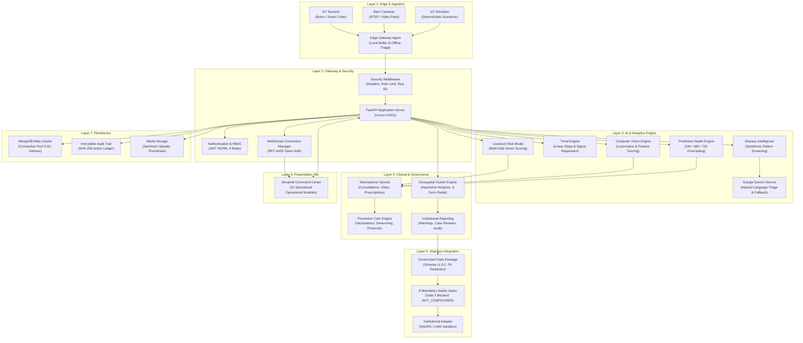

# VETRA — Final System Architecture
## Production Technical Architecture, Component Topology & Data Flow Specification

**Platform:** VETRA Intelligent Livestock Health Platform  
**Document:** `docs/VETRA_FINAL_ARCHITECTURE.md`  
**Version:** `15.0.0-SIH-FINAL`  

---

## 1. High-Level Architectural Overview

VETRA is engineered as an enterprise-grade, multi-tier platform combining real-time edge sensory ingestion, asynchronous event processing, dual-tier AI intelligence, and human-governed institutional workflows.



---

## 2. Detailed 7-Layer Architecture Breakdown

### Layer 1: Edge & Ingestion Tier
- **Hardware Integration:** Compatible with standard LoRaWAN/BLE reticular temperature-rumination boluses, ear-tag accelerometers, and smart collars.
- **Simulator Subsystem (`simulator/iot_simulator.py`):** Deterministic generator capable of outputting continuous normal streams, subclinical early warnings, acute fever anomalies, and custom SIH judging scenarios.
- **Edge Resilience Agent (`simulator/edge_agent.py`):** Embedded client capable of operating locally on low-cost hardware (Raspberry Pi 4 / Jetson Nano). Maintains an offline FIFO queue and executes local threshold safety checks during cellular backhaul outages.

### Layer 2: API Gateway & Security Tier
- **Framework:** FastAPI 0.115+ running on Uvicorn ASGI with Python 3.11.
- **Security Middleware (`backend/app/middleware.py`):**
  - Unique UUIDv4 `X-Request-ID` attached to all request/response cycles.
  - Production security headers: `X-Content-Type-Options: nosniff`, `X-Frame-Options: SAMEORIGIN`, `Referrer-Policy: strict-origin-when-cross-origin`.
  - Application-level sliding window rate limiting (120 requests / 60 seconds per IP) defending against brute-force attacks.
  - Strict upload bounding enforcing a 25 MB payload ceiling.
- **Authentication & RBAC (`backend/app/security.py`, `backend/app/permissions.py`):**
  - HMAC-SHA256 JWT access tokens with 24-hour expiry.
  - Granular role permission gates partitioning access across `farmer`, `veterinarian`, `institutional_officer`, and `admin`.

### Layer 3: AI & Analytics Intelligence Tier
- **Multi-Vital Livestock Risk Model (`ai_engine/risk_model.py`):** Multi-dimensional vector deviation model computing continuous health risk scores (0–100) and discrete categories (`low`, `moderate`, `high`, `critical`).
- **Trend Engine (`ai_engine/trend_engine.py`):** Real-time linear regression computing vital rate-of-change ($\sigma/\text{day}$) and distinguishing acute spikes from diurnal circadian oscillations.
- **Computer Vision Pipeline (`ai_engine/computer_vision.py`):** Headless OpenCV image/video processing for locomotion scoring, back-arch posture detection, and stride asymmetry evaluation.
- **Predictive AI Engine (`ai_engine/predictive_health.py`):** Time-series forecasting model projecting risk probabilities over 24h, 48h, and 72h horizons with clinical safety disclaimers.
- **Generative AI & Fallback Service (`ai_engine/gemini_service.py`):** Natural language clinical reasoning powered by Google Gemini API, with 100% deterministic fallback when offline.

### Layer 4: Clinical & Governance Tier
- **Telemedicine Subsystem (`backend/app/services/telemedicine_service.py`):** Manages veterinary consultation queues, interactive chat/video sessions, case triage prioritization, and digital prescription issuance.
- **Preventive Protocol Engine (`backend/app/services/preventive_alert_engine.py`):** Coordinates scheduled vaccination rounds (FMD, HS, Black Quarter), deworming regimes, biosecurity disinfection, and quarantine logging.
- **Epidemiological Cluster Engine (`backend/app/services/disease_cluster_engine.py`):** Evaluates Haversine spatial proximities, cross-farm incidence rates, and syndromic patterns to detect emerging disease clusters.
- **Institutional Governance (`backend/app/services/institutional_reporting_service.py`):** Enforces human verification for regional disease signals and maintains institutional review audit histories.

### Layer 5: Statutory Integration & Safety Gates
- **Standardized Data Package (`backend/app/services/government_data_package.py`):** Generates structured disease surveillance packages conforming to national reporting schemas (NADRS / LIMS v1.0.0).
- **PII Privacy Masking:** Masks farmer identities, sanitizes contact details, and aggregates geospatial markers to district/block administrative boundaries.
- **The 8 Safety Gates:** Multi-stage validation pipeline ensuring zero unauthorized or autonomous external transmissions.
- **Institutional Adapter (`backend/app/services/institutional_adapters.py`):** Pluggable external gateway interface defaulting strictly to `NOT_CONFIGURED` in sandbox and demo modes.

### Layer 6: Presentation Tier (Streamlit Command Center)
A comprehensive, responsive Streamlit dashboard featuring 15 specialized operational modules:
1. `dashboard.py`: Unified Command Center & Herd Health Index
2. `farms.py`: Multi-Farm Infrastructure & Asset Management
3. `animals.py`: Livestock Herd Roster & Demographic Registry
4. `animal_profile.py`: Individual Cattle Electronic Health Record (EHR) & Vitals
5. `monitoring.py`: Real-Time IoT Telemetry Stream & Anomaly Graphs
6. `computer_vision.py`: Image & Video Locomotion Triage Analysis
7. `camera_monitoring.py`: Live Barn Camera Feed & Edge Event Feeds
8. `predictive_ai.py`: Prospective Deterioration Curves & Driver Analysis
9. `alerts.py`: Systemic Alert Queue, Triage & Escalation
10. `surveillance.py`: Geospatial Outbreak Map & Farm Risk Heatmaps
11. `veterinarian.py`: Clinical Case Management & Field Visit Logs
12. `telemedicine.py`: Virtual Consultations & Digital Prescriptions
13. `institutional.py`: District Surveillance, Outbreak Gates & Statutory Packages
14. `prevention.py`: Preventive Care Calendar & Vaccination Protocol Compliance
15. `profile.py`: User Profile, Role Badge & Security Credentials

### Layer 7: Persistence & Storage Tier
- **Database Engine:** MongoDB Atlas (or local replica set) accessed via PyMongo with client-side connection pooling (minimum 5, maximum 50 connections) and 5000ms socket timeouts.
- **Indexing Strategy:** Compound unique indexes on `animal_id`, `tag_id`, `farm_id`, `device_id`, `case_id`, `event_id`, and `package_id`.
- **Immutable Audit Trail (`audit_logs` collection):** Cryptographically timestamped logs recording every clinical decision, login attempt, role elevation, and package generation.
- **Media Store (`media/` directory):** Local directory tree (`images/`, `videos/`, `thumbnails/`) with strict filename sanitization and MIME-type validation.

---

## 3. Container & Deployment Architecture

VETRA is containerized via Docker and orchestrated via Docker Compose:

```
┌────────────────────────────────────────────────────────┐
│                      Host Machine                      │
│                                                        │
│  ┌─────────────────────────┐  ┌─────────────────────┐  │
│  │     vetra-frontend      │  │    vetra-backend    │  │
│  │    (Streamlit :8501)    │  │   (FastAPI :8000)   │  │
│  │   Non-root user vetra   │  │ Non-root user vetra │  │
│  └───────────┬─────────────┘  └──────────┬──────────┘  │
│              │                           │             │
│              └─────────────┬─────────────┘             │
│                            │                           │
│                 Isolated Bridge Network                │
│                      (vetra-net)                       │
│                            │                           │
│              ┌─────────────┴─────────────┐             │
│              │    Persistent Volumes     │             │
│              │  • vetra_media_storage    │             │
│              │  • vetra_logs_storage     │             │
│              └───────────────────────────┘             │
└────────────────────────────┬───────────────────────────┘
                             │ TLS 1.3
                             ▼
               MongoDB Atlas Cloud Database
```

Both container images run with **non-root user `vetra` (UID 1000)**, execute built-in periodic healthcheck probes (`/health`), and communicate over an isolated internal Docker bridge network (`vetra-net`).
